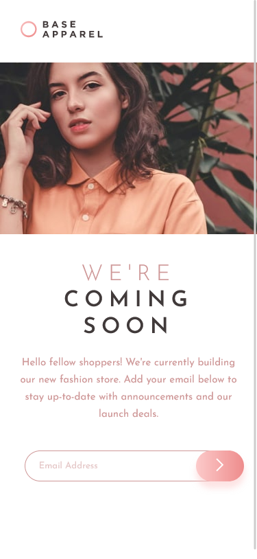

# Frontend Mentor - Base Apparel coming soon page solution

This is a solution to the [Base Apparel coming soon page challenge on Frontend Mentor](https://www.frontendmentor.io/challenges/base-apparel-coming-soon-page-5d46b47f8db8a7063f9331a0). Frontend Mentor challenges help you improve your coding skills by building realistic projects. 

## Table of contents

- [Overview](#overview)
  - [The challenge](#the-challenge)
  - [Screenshot](#screenshot)
  - [Links](#links)
- [My process](#my-process)
  - [Built with](#built-with)
  - [What I learned](#what-i-learned)
  - [Continued development](#continued-development)
  - [Useful resources](#useful-resources)
- [Author](#author)

## Overview

I made a web page with email validation using JavaScript, HTML and CSS. 

### The challenge

Users should be able to:

- View the optimal layout for the site depending on their device's screen size
- See hover states for all interactive elements on the page
- Receive an error message when the `form` is submitted if:
  - The `input` field is empty
  - The email address is not formatted correctly

### Screenshot

### Links

- Solution URL: [Add solution URL here](https://your-solution-url.com)
- Live Site URL: [Add live site URL here](https://your-live-site-url.com)

## My process
I started this MONTHS ago. Really, I did this a long time ago, then I had to start a new semester at uni and I completely forgot about web design. I finished the semester in February and decided to continue with this challenge, because I want to keep practicing and learning. 

I was so lost! I spent hours just looking at the basics of HTML and CSS, trying to figure out what I did before, and then trying to understand why the email validation didn't work. In this case, I added the id='email' in the wrong place (but it took me HOURS to figure this out!).

### Built with

- Semantic HTML5 markup
- CSS custom properties
- Flexbox
- CSS
- Mobile-first workflow

### What I learned

I think I finally learned how to do an email validation. It was pretty basic, and I feel that it isn't completely correct and it still lets me introduce an email like dkjdfg@dlgg, so it doesn't look for the .com, but still I feel an improvement :D

### Continued development

I need more practice with JavaScript. 

### Useful resources

- [W3Schools](https://www.w3schools.com) - I always use this for documentation!
- [W3resource](https://www.w3resource.com/javascript/form/email-validation.php) - I used the regEx expression given in this page for the valid email address. 

## Author

- Github - [María Agudo](https://www.github.com/mdagudo/)
- Frontend Mentor - [@mdagudo](https://www.frontendmentor.io/profile/mdagudo)
